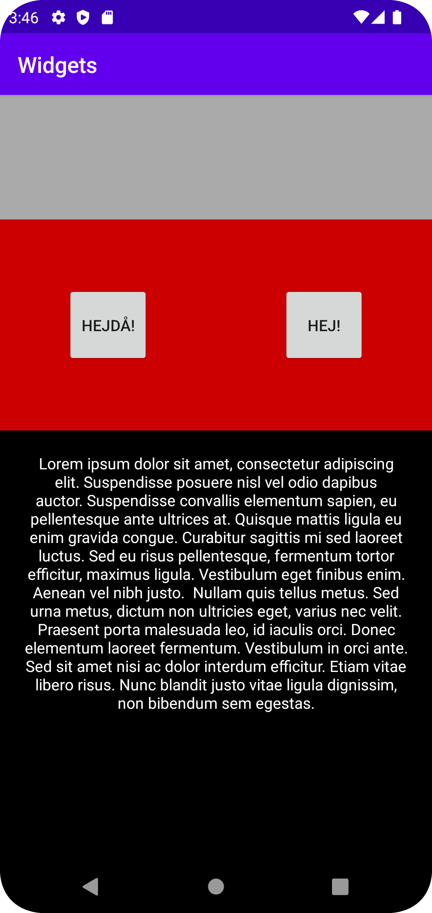

# Rapport

Först skapar jag en vertikal LinearLayout. Se kodexempel 1.

I layout-taggen lägger jag en bild som tar upp övre delen av skärmen. Bilden fyller hela parent elementets bredd 
och för höjden av bilden använder jag wrap_content för att inte fylla hela skärmen. Se kodexempel 2.

Sedan lägger jag in en till LinearLayout i den tidigare layout-taggen, även kallad child, denna LinearLayout är horizontal och inte vertical som den tidigare.
I detta child-element läggs 2 knappar in med texten, HEJDÅ! respektive HEJ!. höjden på dessa knappar är satt som "match_parent". Se kodexempel 3 och 4.

Efter detta skapas ett till child-element som är en LinearLayout där ett TextView element läggs in med Lorem Ipsum text.
Denna Textview stylas med ny bakgrundsfärg och textfärg, även padding och TextAlign används för att positionera texten. Se kodexempel 5 och 6.

När appen körs i Emulatorn så finns inte bilden med, därför har jag bytt bakgrundfärg till grå. Se kodexempel 7.


## Följande grundsyn gäller dugga-svar:


```
----------------------------------------------------
kodexempel 1: android:orientation="vertical"
----------------------------------------------------
----------------------------------------------------
kodexempel 2: <ImageView
                android:id="@+id/imageView"
                android:layout_width="match_parent"
                android:layout_height="wrap_content"
                android:layout_weight="1"
                tools:srcCompat="@tools:sample/avatars" />
---------------------------------------------------
---------------------------------------------------
kodexempel 3:<LinearLayout
                android:layout_width="match_parent"
                android:layout_height="78dp"
                android:layout_weight="1"
                android:background="@android:color/holo_red_dark"
                android:orientation="horizontal">
---------------------------------------------------
---------------------------------------------------
kodexempel 4:  <Button
                    android:id="@+id/button2"
                    android:layout_width="wrap_content"
                    android:layout_height="match_parent"
                    android:layout_margin="60dp"
                    android:layout_weight="1"
                    android:text="Hejdå!" />
---------------------------------------------------
                <Button
                    android:id="@+id/button4"
                    android:layout_width="wrap_content"
                    android:layout_height="match_parent"
                    android:layout_margin="60dp"
                    android:layout_weight="1"
                    android:text="Hej!" />
--------------------------------------------------
--------------------------------------------------
kodexempel 5: <LinearLayout
                android:layout_width="match_parent"
                android:layout_height="wrap_content"
                android:layout_weight="1"
                android:orientation="vertical">
--------------------------------------------------
--------------------------------------------------
kodexempel 6: <TextView
                android:id="@+id/textView"
                android:layout_width="match_parent"
                android:layout_height="wrap_content"
                android:layout_weight="3"
                android:background="@android:color/background_dark"
                android:padding="20dp"
                android:textAlignment="center"
                android:text
                android:textColor="@android:color/white"
                android:layout_gravity="center_horizontal" />
--------------------------------------------------
--------------------------------------------------
kodexempel 7: <LinearLayout xmlns:android="http://schemas.android.com/apk/res/android"
                xmlns:app="http://schemas.android.com/apk/res-auto"
                xmlns:tools="http://schemas.android.com/tools"
                android:layout_width="fill_parent"
                android:layout_height="fill_parent"
                android:background="@android:color/darker_gray"
                android:orientation="vertical"
                tools:context=".MainActivity">
-------------------------------------------------
```

Bild på appen i emulatorn.
.

